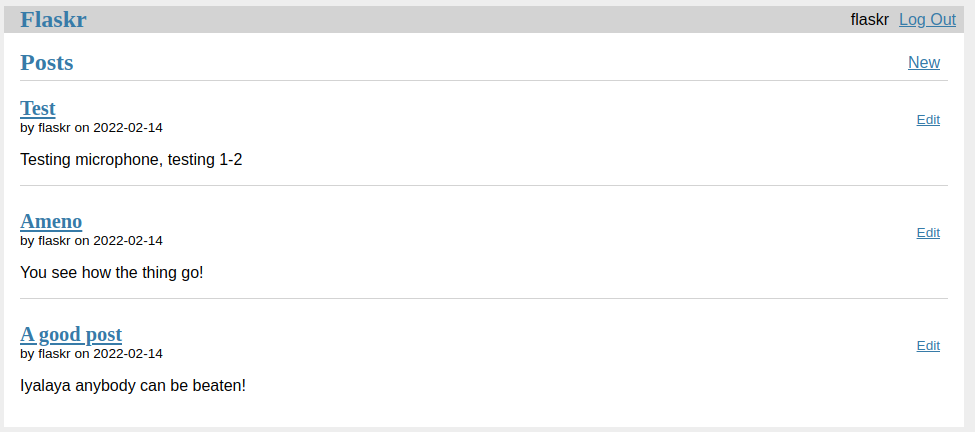

## A blog called Flaskr

> A walk-through of the official [flask](https://flask.palletsprojects.com/en/2.0.x/tutorial/) documentation tutorial.
> Implementing some of the further exercises
> The aim is to get a low-level feel of the framework without
> flask extensions

A basic blog application called Flaskr. 

- Users will be able to register, log in, create posts, and edit or delete their own posts. 

- You will be able to package and install the application on other computers.

This implementation uses what's provided by Flask and Python only - no third -party extensions.

